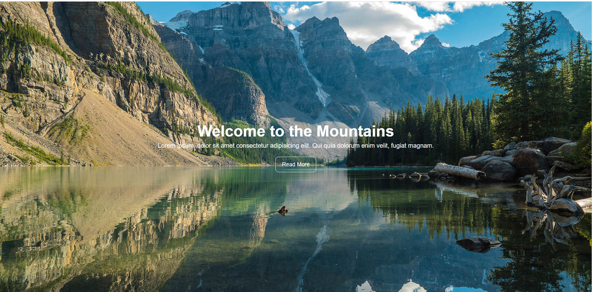

# The Mountains Landing Page
> A Tutorial project taught by Brad Traversy of Traversy Media on YouTube

This tutorial project is to help familiarize myself with HTML and CSS as well as playing with positioning and working with images

## Features

Some of the Features of the Landing Page are;
* Fully responsive page that adjusts to any screen size
* The use of buttons and hover states
* Flexbox for the sections at the bottom of the page

## Links

Here are some links that are useful to better understand this tutorial project:

- Repository: https://github.com/JulianEhiem/HTML-CSS-LandingPage
- Traversy Media YouTube Tutorial: https://www.youtube.com/watch?v=hVdTQWASliE&list=PLC5qlJjNsSwJb5akghLXYOgfLEzltF1W2&index=25&t=611s
 
- Related projects:
  - My Online Portfolio: https://julianehiem.github.io/
 

